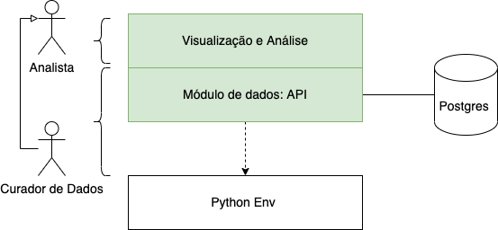
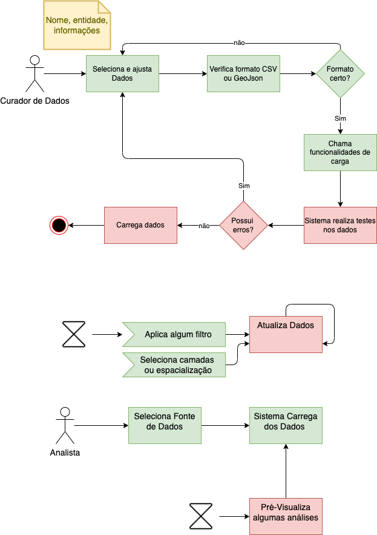

Provas de Conceito
========================

A solução está organizada em dois grandes módulos funcionais:

#. Gerenciamento de dados: responsável pela funcionalidade de curadoria de dados
#. Visualização e Análise: responsável pela obtenção, processamento e visualização das análises sobre os dados

A solução ainda está organizada de maneira a permitir interações tanto via interface web. Essa prerrogativa permite a fácil customização de serviços e ainda privilegia usuários avançados na análise de dados.

Os usuários conceituais definidos para as provas de conceito estão organizados em níveis de acesso. A autenticação e autorização deve ser realizada via banco de dados:

#. Curador de dados: responsável pela manutenção de informações. Cada secretaria terá seu próprio responsável ou equipe para esta finalidade. 
#. Analistas: usuários das diversas secretarias que desejam realizar análises sobre os dados. 

As funcionalidades previstas são apresentadas abaixo. 
Em verde as funcionalidades obtidas diretamente. Em Azuis funcionalidades gerais de dados. Em amarelo funcionalidades para mapas. 
Em vermelho funcionalidade para gráficos e em cinza, funcionalidade pública geral:

.. image:: ../images/casos.png
  :width: 500
  :alt: Casos de uso da solução proposta para os PDCs

Este diagrama apresenta que um Analista também é um usuário da prova de conceito. 
Ele visualizará 2 funções principais no ambiente (em verde): 

#.	Visualizar dados: engloba todos os mecanismos de visualização a serem construídos, começando pela Seleção de Fonte de Dados. Com os dados selecionados, este poderá aplicar filtragens, via Filtragem de Dados. Esses dados podem ser apresentados na forma de texto, gráficos (via Geração de Gráficos) e ainda mapas. Os mapas ainda poderão ser configurados ao Adicionar suporte espacial e Adicionar novas Camadas.
#.	Obter Fontes de Dados: consiste em permitir que as fontes de dados sejam recuperadas

O curador de dados ainda possui como responsabilidade a manutenção das informações atualizadas. Este acumula todas as funcionalidades apresentadas anteriormente.
Isso permite que ele teste as informações inseridas na base. As funcionalidades são:

* Manter Dados: inserir, remover, atualizar fontes de informações na base. As informações de suporte espacial serão inseridas diretamente via API disponibilizada. As informações de métricas ou indicadores serão inseridas via funcionalidade específica.

A partir das funcionalidades descritas, podemos organizar os módulos das PDCs no diagrama de componentes apresentado abaixo.
Além do módulos propostos, ainda são apresentados o Postgres como centralizador de dados e toda implementação sobre ambiente python.

O fluxo básico de funcionamento da solução é representado abaixo. Entende-se que pela sua simplificação, a prova de conceito
deseja apresentar a viabilidade de construção de soluções sobre análise de dados. 
Ou seja, a construção da PDC foi focada na simplicidade e capacidade de implantação no ambiente real da prefeitura de São Luís, 
cabendo a esta uma série de melhorias que poderiam acontecer de acordo com o requisito necessário.

